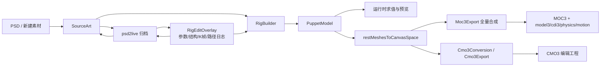

# 运行时、编辑与导出数据结构及功能缺口

更新：2026-09-14。本文按当前源码盘点，不把格式解析器中存在的类型等同于产品功能，也不把原文件的未解析字段透传等同于完整支持。

## 1. 四层数据结构

| 层 | 权威对象 | 负责内容 | 不负责内容 |
| :--- | :--- | :--- | :--- |
| 源工程层 | `SourceArt`、`AgentWorkspaceDocument`、`WorkspaceHistoryTree`、素材库 | PSD 图层、栅格、分类、放置、设置、历史分支和 `RigEditOverlay` | 每帧求值、最终 MOC3 布局 |
| 统一运行时层 | `PuppetModel` | 参数、Part、Warp/Rotation、ArtMesh、Glue、关键形、通道、Blend Shape、绘制树、画布和目标版本 | CMO3 全部编辑器元数据、动作/物理等所有边车 |
| 格式语义层 | `Cmo3Model` 对象图、`MocDocument` | CMO3 XML/引用图与 MOC3 各 section 的类型化表示 | 产品级编辑语义和工作区历史 |
| 求值/交付层 | `CpuDeformationEvaluator`、渲染器、`Moc3Sidecars`、Pipeline | 参数采样、父子形变、Glue、绘制通道、纹理渲染、文件族组装 | 编辑器控制器本身的交互行为 |

`PuppetModel` 是渲染、几何编辑和两种模型格式之间的核心边界。主要成员如下：

- `parameters`：范围、默认值、普通/Blend Shape 类型、Repeat。
- `parts` 与 `rootChildren`：Parts 面板组织树；`Part` 还保存可见性、绘制顺序组和离屏合成。
- `deformers`：`Warp` 的格点关键形和 `Rotation` 的中心、角度、缩放关键形，均可带渲染通道与 Blend Shape。
- `drawables`：静息网格、UV、三角形、纹理页、遮罩、混合模式、几何关键形与颜色/透明度/绘制顺序通道。
- `glues`：两个 ArtMesh 的顶点对、权重和强度关键形。
- `renderRoot`：绘制顺序组树；`parameterLinks` / `parameterTree`：参数面板结构。
- `canvasWidth`、`canvasHeight`、世界原点、`pixelsPerUnit`：画布和导出换算信息。
- `runtimeTarget`：编辑兼容性目标；它不限制内部渲染，只在导出时选择版本并报告/剥离不兼容能力。
- `deformPaths`：编辑辅助路径；运行时不执行路径，拖动结果写成 ArtMesh 关键形后由运行时照常求值。

`PuppetModel` 采用不可变快照。关键形按对象分别保存几何网格和 `ChannelGrids`，求值时对参数网格采样，再按父 Warp/Rotation 链变换 ArtMesh，最后应用 Glue、Part 级联、绘制顺序和颜色/透明度。

## 2. 持久化与数据流

`.psd2live` 保存源图、工程设置、资产和历史节点中的 `RigEditOverlay`，不把当前 `PuppetModel` 当成唯一真相。打开工程时重新执行 Rig 构建，再顺序重放编辑。因此新增可编辑功能若只修改 `PuppetModel`，却没有进入 `RigEditOverlay` / `authoringJournal`，重开后会丢失。

CMO3 有两条路径：

- 从 CMO3 打开：`Cmo3Model` 保留完整读取对象图，`Cmo3Import` 投影成 `PuppetModel`；导出时 `Cmo3Export` 比较基线和编辑结果，只改能表达的字段。没有被程序理解但仍可达的原图字段通常能原样保留。
- 从 PSD/MOC3 新建 CMO3：`Cmo3SkeletonBuilder` 建空工程，再把 `PuppetModel` 全量降低进去。未进入 `PuppetModel` 或没有合成器的编辑器数据不会凭空出现。

MOC3 导出始终从 `PuppetModel` 全量合成 `MocDocument`，没有 CMO3 式的未知字段透传。`restMeshesToCanvasSpace` 负责解决静息网格使用画布坐标、关键形使用父级局部坐标的混合约定。导出产生的 `.moc3` 只含运行时模型；`model3.json`、`cdi3.json`、`physics3.json`、动作、表达式、Pose 和 UserData 属于边车文件族。

## 3. 当前编辑接口

程序存在两套编辑入口，不能混为一谈：

| 入口 | 状态所有者 | 已覆盖 | 主要缺口 |
| :--- | :--- | :--- | :--- |
| PSD2Live 工作区与 MCP | `PSD2LiveViewModel`、`AgentWorkspaceDocument`、追加式历史 | 图层/素材、参数、对象结构、Warp 创建、Mesh/Warp/Rotation/Part/Glue 关键形、通道、基础物理、路径日志 | 很多底层能力未暴露；合并 MCP 只公开十个高层工具 |
| Umamo 通用编辑会话 | `EditorSession`、`History`、`Change` | 对象选择、Mesh/UV 变换、拓扑操作、参数与关键形、撤销重做 | `EditorMode.Edit` 的注释仍称路由桩；UV Vertex Slide 明确未实现；它也不是 PSD2Live 工程历史的权威状态 |

对外 MCP 目前以 `inspect/deform/form/rig/view/asset/physics/appearance/revision` 等合并工具为边界。底层 `AgentWorkspace` 已有参数删除、任务记录、逐点关键形等方法，并不代表它们都在当前合并工具面可调用。写接口必须带当前历史 `state`，成功后产生一个新历史节点。

导出接口的共同约定是“文件仍然写出，损失必须报告”。`ExportReport` 收集 `UnsupportedChange`、目标版本剥离和源图缺失等通知。调用方不能只检查文件是否生成，还应检查报告是否为空。

## 4. 格式与功能覆盖矩阵

| 功能 | 统一运行时 | CMO3 导入/导出 | MOC3 导入/导出 | 编辑入口 | 结论 |
| :--- | :---: | :---: | :---: | :---: | :--- |
| 参数、链接、分组、Repeat | 是 | 是 | 是（名称/分组依赖 CDI3） | 部分 | 核心完整；合并 MCP 未公开参数删除 |
| ArtMesh 网格/UV/遮罩/混合 | 是 | 是 | 是 | 部分 | UV 和拓扑底层可编辑，PSD2Live 主工作区接口不完整 |
| Warp/Rotation 与父级链 | 是 | 是 | 是 | 是 | 基本完整；跨父级换绑不保证全运动保真 |
| Part/绘制顺序组/离屏合成 | 是 | 是 | 是，受版本限制 | 部分 | 数据完整度高，缺少完整产品编辑器 |
| Glue | 是 | 是 | 是 | 关键形接口可写 | 缺少可视化配对、权重绘制和修复工具 |
| 普通关键形与颜色/透明度通道 | 是 | 是 | 是 | 是 | CMO3 单网格打包限制可能触发导出通知 |
| Blend Shape 与权重限制 | 是 | 是 | 是，受版本限制 | 很少 | 底层模型和导出强，创建/曲线/限制编辑入口明显不足 |
| 变形路径 | 编辑辅助模型 | 原生控制器读写 | 仅烘焙后的 Mesh K 帧 | 实验性 | 单 ArtMesh；算法与官方一致性、跨 ArtMesh 尚未完成 |
| Physics | 不在 `PuppetModel`，配置在工程覆盖层/边车 | 新工程可注入基础配置 | `physics3.json` 生成或透传 | 简化接口 | 不是完整 Cubism Physics 编辑器 |
| Motion/Expression/Pose/UserData | 不在核心模型 | 原图多为对象图透传；新工程按生成器能力 | 边车生成或透传 | 很少/无 | 缺少统一可编辑领域模型 |
| ArtPath | 否 | 类型存在；原 CMO3 可透传 | 无对应运行时对象 | 无 | 未实现 |
| Motion Sync | 否 | 类型与空骨架存在；原数据可透传 | 边车族未纳入核心模型 | 无 | 未实现 |
| 扩展插值（Ellipse/SNS） | 否 | 新关键形固定写 Linear；原图可能透传 | 运行时语义未建模 | 无 | 不完整 |
| 指南线、随机姿态、视图/游标设置 | 否 | 类型存在；新工程只建空默认值 | 不适用 | 无 | 仅格式壳/透传 |

## 5. 优先缺口清单

### P0：会造成数据误判或不可逆损失

1. **明确区分 CMO3 透传与语义支持。** ArtPath、Motion Sync、随机姿态、指南线、Viewer 设置等类型虽然能被通用对象图读取和重写，但没有进入 `PuppetModel`。原 CMO3 的无关编辑可能保留它们；从 PSD/MOC3 新建或对相关内容做语义编辑则不支持。导入检查器应展示“保留但不可编辑”的负载清单。
2. **Sidecar 建立统一项目模型。** Physics、Motion、Expression、Pose、UserData 和 Motion Sync 现在分散在生成器、工程设置或 `Moc3Sidecars` 透传项中。应建立 `ProjectAssets`/`RuntimeSidecars` 权威模型，定义导入、修改、重命名 ID、删除对象和导出的引用完整性。
3. **导出报告进入强制验收。** 已有 `ExportNoticeReason` 很全面，但产品层需要在 UI、CLI、MCP 返回相同结构化结果，并把“文件生成成功但有降级”与“完全保真”分开。
4. **MOC3 少见 section 的证据不足。** `MocDocument` 注明 Glue Blend Shape 的 section 149–151 因无样本而不解码为语义对象。需要真实语料、差分 oracle 和 round-trip 测试，不能把 section 表存在当作支持。

### P1：Cubism 常用建模功能缺失

1. **ArtPath。** 需要运行时/编辑工程领域模型、笔刷资源、点/曲线/宽度/颜色关键形、CMO3 合成和目标版本提示；若只要求运行时，可定义烘焙到 ArtMesh 的明确路径。
2. **完整 Blend Shape 编辑。** 增加绑定创建/删除、每格形状、限制曲线、Rotation/Part 扩展 Blend Shape 和目标版本门控；当前更多是导入导出能力而非可用编辑流程。
3. **完整 Glue 工具。** 增加边界候选、顶点 UID 配对、权重刷、强度预览、拓扑变化后的重绑定与诊断。
4. **扩展插值。** 将 `LINEAR/ELLIPSE/SNS_CURVE`、插入点数和 Scale 纳入运行时关键形元数据、采样器、CMO3 双向映射与编辑器。当前创建关键形时固定 Linear。
5. **物理编辑。** 当前自定义物理是单输入、双粒子摆锤的简化契约。缺少多输入、X/Y/Angle 输出、反转、权重、归一化、任意粒子链、风/重力、FPS、多个设置组和实时诊断。

### P2：编辑器能力与工作流完整性

1. **统一编辑状态。** PSD2Live 的追加式工程历史与 `EditorSession` 的本地撤销模型并存。应规定一个适配层，让 Mesh/UV/拓扑编辑提交为工程日志，否则通用编辑器内成功的操作可能不能随 `.psd2live` 重建。
2. **Mesh/UV 编辑补齐。** PSD2Live 主界面需要公开逐点选择、框选/刷选、拓扑增删、UV 变换；通用编辑器还明确缺少 UV Vertex Slide。
3. **参数和结构 CRUD 对称。** 合并 MCP 应公开已有参数删除，并补 Part/Rotation/Glue 的创建与安全删除、引用迁移、级联预览。
4. **历史事务与 Diff。** 多命令事务、结构化 `history_diff`、长任务接口在内部有设计或实现片段，但未形成当前公开契约。
5. **编辑器辅助元数据。** 指南线、随机姿态、Model Viewer/Track Cursor、模型模板和编辑器布局可作为独立 `EditorMetadata`，避免污染运行时模型，同时允许 CMO3 新建和编辑。

## 6. 新功能接入检查表

新增 Cubism 功能时至少回答以下问题：

1. 权威数据属于源工程、`PuppetModel`、编辑器元数据还是运行时边车？
2. `.psd2live` 保存的是快照还是可重放命令；历史分支和并发 HEAD 如何处理？
3. CMO3 是语义导入/导出，还是仅保留未知对象图？新建 CMO3 能否合成同一数据？
4. MOC3 是否有对应运行时 section；没有时是烘焙、边车、剥离还是拒绝？
5. 参数 ID、对象 ID、父级、遮罩、纹理、顶点 UID 和边车引用变化时如何级联？
6. CPU 求值、官方 SDK 预览和导出重读在默认姿态、关键点和参数区间内是否一致？
7. 目标版本不支持时，编辑控件如何门控，导出报告如何表达损失？
8. UI、CLI 和 MCP 是否共享同一命令/验证层，而不是各自直接改模型？

建议的验收顺序是：领域模型不变量 → 工程日志重放 → CMO3 原文件保留与新文件合成 → MOC3/边车重读 → 多姿态几何和像素对照 → Cubism Editor 实际打开、编辑、重存。只有最后一项也通过，才能声称与 Cubism Editor 工作流兼容；算法效果一致还需要固定模型与操作序列的差分比较。

## 7. 相关源码入口

- 运行时模型：`org/umamo/runtime/model/`
- CMO3 图与序列化：`org/umamo/format/cmo3/`
- CMO3 双向映射：`org/umamo/interop/cmo3/`
- MOC3 语义格式：`org/umamo/format/moc3/`
- MOC3 双向映射：`org/umamo/interop/moc3/import/`、`export/`
- 求值与坐标换算：`org/umamo/runtime/eval/`、`org/umamo/render/Moc3RestMesh.kt`
- 工程保存与恢复：`io/github/psd2live/project/`、`history/`、`agent/AgentWorkspaceStore.kt`
- 可重放编辑：`io/github/psd2live/core/RigEditOverlay.kt`、`RigAuthoringJournal.kt`
- MCP 接口：`io/github/psd2live/agent/AgentAuthoringTools.kt`、`AgentWorkspace.kt`
- 通用编辑会话：`org/umamo/edit/`
